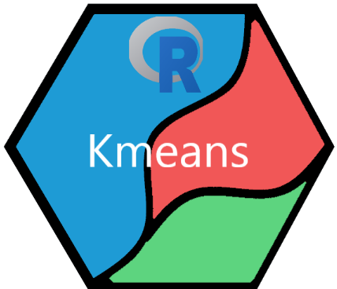

# kmeans_R

[](https://github.com/UBC-MDS/kmeans_R/issues)

## Installation

Install this package directly from GitHub:

```
devtools::install_github("UBC-MDS/kmeans_R")
library(kmeansR)
```

## Usage

Simple example demonstrating the functionality of this package:

```
# generate synthetic data with three clusters
synth_data <- data.frame(
  x = c(rnorm(20,1,1), rnorm(30,6,3), rnorm(15,10,2)),
  y = c(rnorm(20,5,2), rnorm(30,2,2), rnorm(15,8,3))
)

# initialize the cluster centers
centers <- kmeans_init(data= synth_data, K = 3)
# cluster the data points
clusters <- kmeans_cluster(data = synth_data, centers = centers)
# generate summary results
report <- kmeans_report(synth_data, clusters$assignments)

# plot the clustered data
report$plot
```

## Overview

**kmeans_R** is an R package aimed towards a user-friendly way of exploring and implementing k-means clustering.

The package integrates and simplifies different functions, such as [kmeans](https://stat.ethz.ch/R-manual/R-devel/library/stats/html/kmeans.html) and [KMeans_rcpp](https://cran.r-project.org/web/packages/ClusterR/ClusterR.pdf), into one easy-to-use package.

The package includes the following functions:

* `kmeans_init(data, K, algorithm = "kmeans++")` Selects initial values (or seeds) for k-means clustering based on the input `data` object. `K` number of initial values are chosen by applying the specified `algorithm`. Returns a matrix with coordinates for initialization values, where each row is an initialization value and the columns correspond with the columns of the input data object.

* `kmeans_cluster(data, centers, max_iter=100)` Classifies each observation in `data` by performing k-means clustering. The number of clusters is derived from the number of initial centers specified in `centers`. `max_iter` defaults to 100 and simply places on an upper bound on the number of iterations that take place. Returns a list containing the original data and assigned cluster labels.

* `kmeans_report(data, assignments)` Visualizes clustered data using original `data`
and the `assignments` as determined by the cluster function. Returns a list containing
a data frame with original data and assignments, a plot object if data is two dimensional,
and a summary table containing counts of the number of points in each cluster.

## Contributors

[Bradley Pick](https://github.com/bradleypick)

[Charley Carriero](https://github.com/charcarr)

[Johannes Harmse](https://github.com/johannesharmse)
